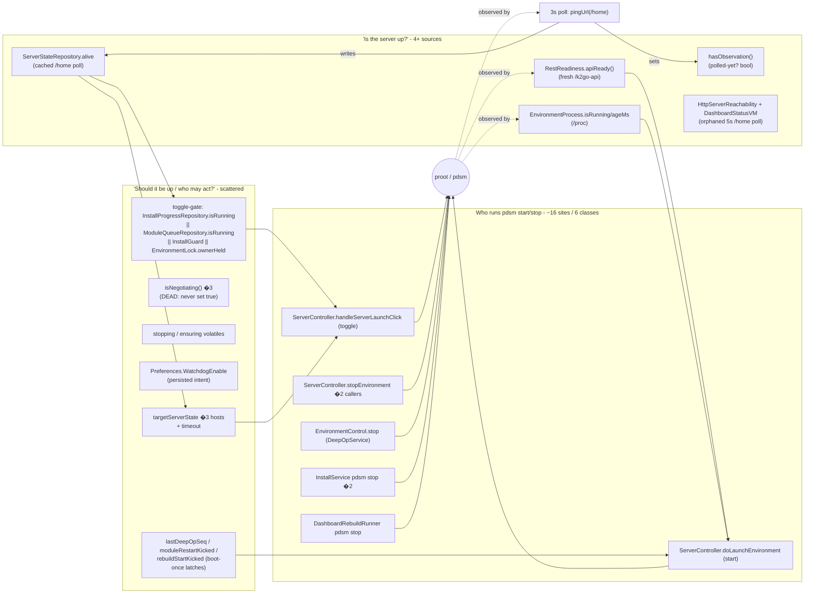
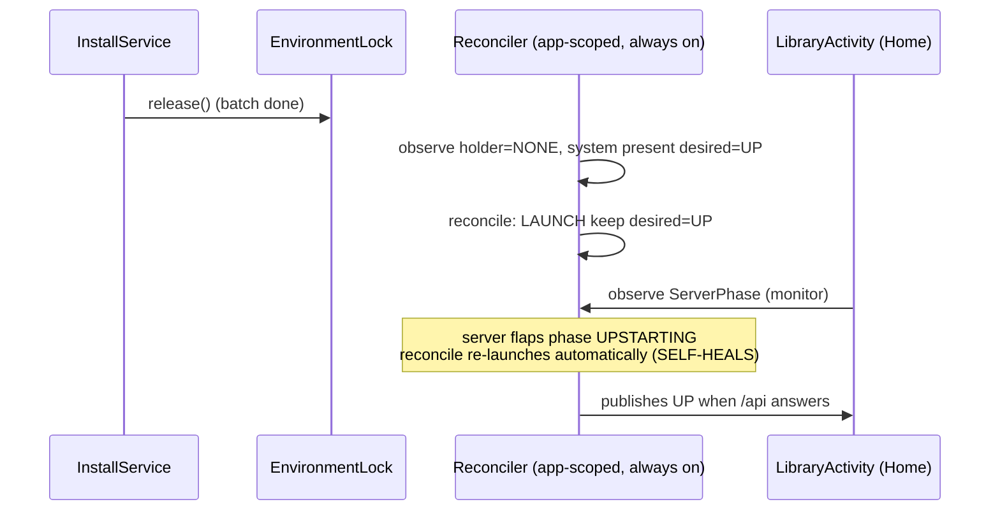

# ADR-5343 - A single process-scoped server-lifecycle reconciler

**Status:** Proposed - design phase, **no production code until approved** (per the active
server-lifecycle redesign brief).
**Date:** 2026-08-28
**Deciders:** Luis (sign-off required before any code).
**Ticket:** ADFA-5343 (a Task under Epic ADFA-1028 — no new epic). Subsumes the orbiting cluster
ADFA-4842, ADFA-4837, ADFA-5280, ADFA-5103, ADFA-4957, ADFA-4919, and resolves the two open bugs
ADFA-5330 / ADFA-5336. Sibling to **ADR-5061** (the operation model): 5061 decides *which class* an operation
is (LIVE/REST vs STOPPED/proot); **this ADR decides who owns keeping the server in its desired
state, and from what single truth.**

> Method note. This ADR was produced read-only: the crux files were read directly and the breadth
> mapped by five parallel recon agents. Every structural claim cites `File.java:line`. The reduction
> scorecard (�8) is the acceptance criterion for the whole effort; if a proposal does not make those
> numbers go **down**, it is wrong by the brief's hard gate.

---

## 1. Context

The box runs a Debian environment inside a `proot`, fronted by nginx on `:8085` and a dash-node REST
core under `/k2go-api` (`config/BoxEndpoints.java:21,29`). Two mechanisms move it (already decided,
see ADR-5061): **LIVE/REST** operations run against the live server; **STOPPED/proot** operations
`pdsm stop` the whole box, run a transient `proot --kill-on-exit` runrole, and expect the *app* to
boot the box back.

The mechanisms are not the problem. The problem is **ownership of one fact - "the server should be
up" - is missing**, and every screen and operation re-derives and re-actuates it locally.

### 1.1 The structural root (validated, not assumed)

`ServerController` is **Activity-scoped** - constructed with an `AppCompatActivity` + a `Host`
callback (`ServerController.java:102`). The `proot` it launches via `PRootEngine` is
**process-scoped**: it outlives any Activity and, sometimes, the app. After the constructing Activity
dies, the running server is detectable **only by re-reading `/proc`** (`env/EnvironmentProcess.java:97`).

There is **no MainActivity** any more (the class doc at `ServerController.java:13` is stale;
`SplashActivity.java:67` routes to `LibraryActivity`). `ServerController` is constructed in exactly
three Activities, each its own `Host`, each with its **own** copy of the transition state:
`LibraryActivity` (`redesign/LibraryActivity.java:273`), `SetupProgressActivity`
(`redesign/SetupProgressActivity.java:168`), `SetupLibraryActivity`
(`redesign/SetupLibraryActivity.java:123`).

**No foreground service is a persistent owner of "server should be up."** `WatchdogService` is
`START_STICKY` (`WatchdogService.java:60`) but only holds a wakelock + wifilock + notification - it
revives the *lock*, not the server. `DeepOpService`, `DashboardRebuildService` and `InstallService`
only **stop** the box and hand the reboot back to whichever Activity is foregrounded
(`deepop/DeepOpService.java:196-201`; `redesign/DashboardRebuildRunner.java:26-31`;
`install/presentation/InstallService.java:1207-1210`).

So "the server should be up" is a **baton** passed between whichever Activity happens to be
foregrounded, and `startEnvironment()` is scattered across `LibraryActivity`, `SetupProgressActivity`,
`BackupRestoreFragment`, and `CloneFragment` with no process-scoped holder.

### 1.2 What that absence forces (each an accretion, each cited)

1. **The monitor/actuator split** (ADFA-4842). Because there is no always-on actuator, one screen was
   designated the actuator and the rest monitors: `startEnvironment()` is "UNCONDITIONAL . DO NOT
   replace with the toggle" (`ServerController.java:242-260`) while Home "is a MONITOR, not an
   actuator" and refuses to boot in `onNewIntent` (`redesign/LibraryActivity.java:870`).

2. **The toggle-as-API keyed on a stale cache.** `handleServerLaunchClick()` starts XOR stops based on
   the **cached** `ServerStateRepository.get().current().alive` (`ServerController.java:393`). Right
   after a module batch's `pdsm stop`, the cache still reads TRUE for up to one 3 s poll, so the
   toggle would *stop* when it must *start* - the exact bug the unconditional `startEnvironment()`
   exists to dodge (`ServerController.java:251-256`).

3. **Four liveness sources for one question.** "Is the server up?" is answered by
   (a) cached `ServerStateRepository.alive` from an nginx `/home` ping (`ServerController.java:164,171`),
   (b) `hasObservation()`, a companion bool distinguishing "polled-down" from "never polled"
   (`ServerStateRepository.java:44`),
   (c) fresh `RestReadiness.apiReady()` against dash-node `/k2go-api`, which answers only when the
   *upstream* is ready - unlike `/home` (`redesign/RestReadiness.java:9-11,25`),
   (d) `EnvironmentProcess.isRunning()` / `environmentAgeMs()` from `/proc`
   (`env/EnvironmentProcess.java:97,111`).
   Plus a **fifth, orphaned** `/home` poller: `dashboard/data/HttpServerReachability` +
   `DashboardStatusViewModel` (5 s), whose factory has no consumer and which never publishes to
   `ServerStateRepository`.

4. **A ladder of compensation flags**, each patching a race a single owner would not have: the
   `stopping` and `ensuring` volatiles (`ServerController.java:82,87`), the fixed 20 s
   `BOOT_GRACE_MS` (`ServerController.java:43`), the fresh-liveness override at ensure-time (ADFA-5280,
   `ServerController.java:277-283`), `hasObservation()` (ADFA-5061), the `lastDeepOpSeq` "boot once
   after a deep-op" latch (`redesign/LibraryActivity.java:100`, ADFA-4957), and the index latches
   `moduleRestartKicked` / `rebuildStartKicked` / `moduleServerUp` / `moduleServerFailed`.

### 1.3 Evidence of accretion

**17 distinct ADFA tickets** have edited just `ServerController` + `env/` + `RestReadiness`
(ADFA-5103 alone touches 10 sites). The git timeline (Jul 6  Aug 28) shows each ticket adding a
state to compensate for a missing owner - a representative slice:

| ~order | ADFA | added | compensates for missing. |
|--------|------|-------|---------------------------|
| 4578 | `ServerState` + `ServerStateRepository` (`f32ef96c`) | one observable `alive` fact | a single source of truth (each tab read its own) |
| 4842 | unconditional `startEnvironment()` + "Home is a monitor" (`98f9d5f6`) | one owner of the post-module boot | an always-on actuator |
| 4957 | `lastDeepOpSeq`, `ownerHeld` gate (`7233a3ed`) | "boot the server after a deep-op finishes" owner | a reconciler that re-drives desiredactual |
| 5061 | `EnvironmentProcess` (`/proc`) + `hasObservation()` (`a901befe`) | direct "is our proot alive" vs cached; "polled-down" vs "never-polled" | one freshness-aware liveness source |
| 5103 | `ensuring`, `BOOT_GRACE_MS`, `EnvironmentEnsure.decide` (`c3938e05`) | stopped-service vs stopped-environment; no-double-launch across 6 callers | a serialized single actuator |
| 5280 | ensure reads **fresh** `apiReady()` not cached `alive` (`be29110d`) | a freshness owner for the "alive" cache | one liveness source, always fresh-enough |

> The two open bugs - **ADFA-5330** (ungraceful kill  stale marker  false "reinstall") and
> **ADFA-5336** (post-install server flap  stuck hand-off; only a manual relaunch recovers) - appear
> **nowhere in the code**. They are the next two accretions waiting to be written. �5 shows both are
> the *same* missing owner.

### 1.4 The current server-lifecycle state machine (as it is today)

States marked ? exist only to compensate for the missing owner.

```mermaid
stateDiagram-v2
    [*] --> UNKNOWN
    UNKNOWN: UNKNOWN<br/>(seeded alive=false, never polled;<br/>hasObservation() compensates)
    DOWN: DOWN
    STARTING_SILENT: STARTING ?<br/>(pre-pdsm silent window;<br/>onStartupBegan, ADFA-4837)
    STARTING_GRACE: STARTING / BOOT-GRACE ?<br/>(proot up, /api down, age under 20s;<br/>WAIT_BOOT_GRACE)
    UP_NGINX: UP (nginx only) ?<br/>(/home answers, /api not yet;<br/>the flap window)
    UP: UP (fully serving)
    STOPPING: STOPPING (graceful)
    QUIESCED: QUIESCED ?<br/>(stopEnvironment: pdsm stop only,<br/>proot kept, ADFA-4952)
    STOPPED_DEEPOP: STOPPED-BY-DEEP-OP ?<br/>(lock held; who reboots?)
    STOPPED_INSTALL: STOPPED-BY-INSTALL ?<br/>(InstallGuard set; stand back)
    ORPHAN: ORPHAN ?<br/>(proot up, /api down, age over 20s;<br/>KILL_AND_RELAUNCH)
    DAMAGED: DAMAGED? ?<br/>(marker set AND !reachable in window;<br/>false-reinstall risk, ADFA-4971)

    UNKNOWN --> UP: poll sees /home
    UNKNOWN --> DAMAGED: evaluateRecovery (cached alive)
    DOWN --> STARTING_SILENT: startEnvironment (1 of ~16 sites)
    STARTING_SILENT --> STARTING_GRACE: proot spawned
    STARTING_GRACE --> UP_NGINX: nginx up first
    STARTING_GRACE --> ORPHAN: age crosses 20s, /api still down
    UP_NGINX --> UP: dash-node upstream ready
    UP_NGINX --> ORPHAN: dash-node restarts, age over 20s (flap, wrongful kill)
    ORPHAN --> STARTING_SILENT: killOrphan + relaunch
    UP --> STOPPING: turnOffK2Go / toggle
    UP --> QUIESCED: stopEnvironment (backup/restore/clone)
    UP --> STOPPED_DEEPOP: DeepOpService / clone stop
    UP --> STOPPED_INSTALL: InstallService pdsm stop
    STOPPING --> DOWN
    QUIESCED --> STARTING_SILENT: host Activity reboots (if alive)
    STOPPED_DEEPOP --> STARTING_SILENT: 1 of 2 re-owners (ambiguous)
    STOPPED_INSTALL --> STARTING_SILENT: index actuator (if alive)
    DAMAGED --> [*]: reinstall dialog
```

### 1.5 The sources-of-truth map (who writes / reads each fact)



---

## 2. Decision

Introduce **one process-scoped `ServerLifecycleReconciler`** - the single owner of the server
lifecycle - and make everything else an **observer** or an **intent-setter**.

1. **One desired state.** `desired = RUNNING` **iff** the system is present-and-healthy **and** no
   holder wants it down:

   ```
   desired = SystemFacts.installed && SystemFacts.healthy
             && userWantsOn
             && EnvironmentLock.currentHolder.executionClass != STOPPED
   ```

   Every input already exists: `installed`/`healthy` come from `system/data/SystemFactsReader.java:72-89`
   (which already folds `InstallGuard` + `InterruptedInstallDetector`); `userWantsOn` is the persisted
   intent that `Preferences.WatchdogEnable` is *already* standing in for today
   (`ServerController.java:342,461`).

   The last term keys on the **holder's execution class, not on `== NONE`.** Not every holder wants the
   server down. ADR-5061 **already** owns that split in one pure-JVM type,
   `system/domain/Operation.ExecutionClass { LIVE, STOPPED }` (`system/domain/Operation.java:49-61`),
   whose own doc is exactly our distinction: `LIVE` = "the box stays up; the device POSTs and polls the
   in-server REST core"; `STOPPED` = "the box goes down: `pdsm stop`, then Ansible in a transient proot."
   - **STOPPED holders want it DOWN** — CLONE, BACKUP, RESTORE, INSTALL each `pdsm stop` the box and run
     a transient `proot` runrole (`deepop/DeepOpService.java:124,127`; `redesign/CloneFragment.java:475,1322`).
   - **LIVE holders run *against* the live server and want it UP** — DOWNLOAD (the device only POSTs +
     polls; the work runs on the live server, `redesign/ZimDownloadService.java:10`) and DASHBOARD (a live
     dash-node self-update, `EnvironmentLock.java:184-186`, ADFA-5333). Forcing `desired=DOWN` for these
     two would stop the very server they depend on — and would directly contradict §6, which already says
     `DASHBOARD` must stay `UP` (expect only a blip).

   **Reuse that type; do not add a parallel one.** Give the existing `Holder` enum one property that
   returns `Operation.ExecutionClass` (STOPPED for CLONE/BACKUP/RESTORE/INSTALL; LIVE for
   DOWNLOAD/DASHBOARD, and for `NONE` — no holder is forcing the box down). `EnvironmentLock.currentHolder()`
   (`env/EnvironmentLock.java:172-188`) stays the one enumerator of holders; `desired` asks the returned
   holder its class instead of comparing to a magic `NONE`. A new `HolderClass` enum would be a second
   type saying what `ExecutionClass` already says — the same duplicate-truth this ADR exists to remove.
   **No new source of truth is created — `desired` is a pure function of existing facts, the LIVE/STOPPED
   vocabulary has one owner (ADR-5061), and the holder just names its class.**

2. **One liveness source.** A single `ServerLiveness` snapshot, freshness-windowed, replacing the four:

   ```
   ServerLiveness { processPresent (/proc),  servicesAnswering (/api, dash-node),  observedAtMs }
   phase(now) = observedAtMs==0             UNKNOWN
              | servicesAnswering           UP
              | processPresent              STARTING   (proot up, upstream not ready)
              | else                        DOWN
   ```

   `servicesAnswering` is the **honest "usable" signal** - dash-node `/k2go-api`, not nginx `/home`.
   The flap bug (�5, ADFA-5336) is rooted precisely in reading `/home` (which answers before its
   upstream, `redesign/RestReadiness.java:9-11`) as "up." One source, read one way, kills that class.
   `processPresent` is the discriminator that told "services down" from "environment gone"
   (the whole reason `EnvironmentProcess` was added, ADFA-5061). `UNKNOWN` absorbs `hasObservation()`.

3. **Idempotent reconcile, run continuously by the owner.** On a tick (and on any intent change or
   liveness change) the reconciler compares actualdesired and acts - this is **exactly**
   `env/domain/EnvironmentEnsure.decide(...)` (`LAUNCH / NOOP_HEALTHY / WAIT_BOOT_GRACE /
   KILL_AND_RELAUNCH`, `env/domain/EnvironmentEnsure.java:55-70`), which is already pure and
   JVM-tested - **but run by one persistent owner instead of at six scattered call sites.** With a
   **progress-aware grace** (below) replacing the fixed 20 s guess, and start/stop retry+backoff.

4. **Activities become pure observers; the toggle becomes "set desired."** Every screen observes one
   published `ServerPhase` from the reconciler (the way `onNewIntent` already only monitors,
   `redesign/LibraryActivity.java:870`). The user button calls `reconciler.setUserWantsOn(boolean)` -
   it *sets desired*, it does not start-XOR-stop on a cache. Deep operations call
   `EnvironmentLock.acquire(...)` (already the signal); the reconciler observes a **STOPPED-class**
   holder (`executionClass == STOPPED`) and stops, while a LIVE-class holder (DOWNLOAD/DASHBOARD) leaves
   `desired=UP`. On `release(...)` it observes `NONE` and brings the box back **wherever the app is** - no
   Activity owns the reboot.

5. **Home for the owner.** The reconciler is an **app-scoped singleton** (created in
   `IIABApplication`, `IIABApplication.java`) holding desired + last liveness + a single-threaded tick.
   Background survival (wakelock/notification) is delegated to the **existing** `WatchdogService`
   (already `START_STICKY`, `WatchdogService.java:60`), which the reconciler promotes when
   `desired==RUNNING` and tears down when `desired==DOWN`. This **folds `Preferences.WatchdogEnable`
   into desired** rather than keeping a parallel flag. No new always-on component is introduced.

6. **Progress-aware grace, not a fixed 20 s.** The reconciler already sees pdsm service lines it parses
   for the boot screen (`ServerController.java:88,327-330`). "Past grace" becomes *"no forward progress
   for N seconds"*, not *"older than 20 s"* - so a slow device booting past 20 s is not wrongly killed
   (�5, ADFA-5336 / flap).

**One owner, one desired fact, one liveness source, one actuator.** Activities and services express
*intent*; only the reconciler *acts*.

### 2.1 Target state machine (visibly fewer states)

`desired ? {UP, DOWN}` is a **1-bit input**, not a state. The reconciler has five phases; the
compensation states of �1.4 disappear (they become "actual?desired, reconcile").

```mermaid
stateDiagram-v2
    [*] --> UNKNOWN
    UNKNOWN: UNKNOWN<br/>(no liveness observed yet)
    DOWN: DOWN<br/>(actual=down)
    STARTING: STARTING<br/>(proot up, /api not ready;<br/>progress-aware grace)
    UP: UP<br/>(/api answers)
    STOPPING: STOPPING<br/>(pdsm stop in flight)

    UNKNOWN --> UP: liveness: servicesAnswering
    UNKNOWN --> DOWN: liveness: !processPresent
    DOWN --> STARTING: reconcile(desired=UP): LAUNCH
    STARTING --> UP: liveness: servicesAnswering (NOOP_HEALTHY)
    STARTING --> STARTING: reconcile: WAIT (progress fresh)
    STARTING --> DOWN: reconcile: no progress  kill, relaunch next tick
    UP --> STOPPING: reconcile(desired=DOWN): a STOPPED-class holder wants it down / user off
    UP --> STARTING: liveness: !servicesAnswering && desired=UP (auto-heals flap)
    STOPPING --> DOWN: pdsm stop exits
    DOWN --> UP: reconcile keeps desired=UP until achieved
```

The critical new edge is `UP --> STARTING` on a flap while `desired=UP`: the reconciler **re-drives**
the box back up with no user action. That single edge is what ADFA-5336 is missing today.

---

## 3. Options considered

### Option A - Process-scoped reconciler (single owner, desired-state, one liveness, reconcile loop) - **chosen**

| Dimension | Assessment |
|-----------|------------|
| Complexity | **Low-Med** - composes existing pure parts (`EnvironmentEnsure`, `SystemFactsReader`, `EnvironmentLock`, `RestReadiness`, `EnvironmentProcess`); adds one owner + one liveness type |
| Blast radius | Med - touches the actuation call-sites, but incrementally (�7); domain core is unit-tested off-device |
| Durability | **High** - new flows set desired and get correct start/stop/keep-up for free |
| Risk | Med, **staged to Low** - reconciler ships first as a **log-only observer** (Phase 1) before it actuates |
| Reduction | **High** - see �8; removes the monitor/actuator split, the toggle-on-cache, 3 liveness sources, ~15 flags |

**Pros:** one owner ends the baton; the toggle stops racing the cache; flap and stuck-hand-off
auto-heal; the fix is *mostly deletion* because the ingredients already exist. **Cons:** a persistent
reconcile loop must be correct about backoff and not fight legitimate stops (mitigated: `desired` is
derived from `EnvironmentLock.currentHolder`, so a deep op *is* `desired=DOWN`, not a fight).

### Option B - Shared desired-state holder, but keep actuation in Activities

| Dimension | Assessment |
|-----------|------------|
| Complexity | Low |
| Blast radius | Low |
| Durability | Low-Med |
| Risk | Low |
| Reduction | **Partial** - collapses the 3 `targetServerState` copies + liveness, but not the actuators |

Introduce one process-scoped desired flag + one liveness source, but Activities still call
`startEnvironment()`/`stopEnvironment()`. **Rejected:** it does not remove the baton - the
"host Activity gone  box stays stopped" gap (flows a, d, e in �4) survives because actuation still
lives in whichever screen is foregrounded. It reduces some counts but leaves the structural root.

### Option C - Do nothing / keep per-surface derivation and patch each bug

| Dimension | Assessment |
|-----------|------------|
| Complexity | Zero now |
| Reduction | **Negative** - 5330 and 5336 each add another flag/marker discriminator |

**Rejected** - this is the trajectory that produced 17 tickets. See �9 ("If we do nothing").

### Option D - Bind the server to a bound+started foreground Service exposed via `OperationDispatcher`

Fold "ensure server up" into the existing `system/domain/OperationDispatcher` (which already has
`ENSURE_SERVER_THEN_RUN_LIVE`, `system/domain/OperationDispatcher.java:56`). This is **the same idea as
Option A** viewed from the operation model, and it is how A composes with ADR-5061: the dispatcher's
`ENSURE_SERVER_THEN_RUN_LIVE` becomes `reconciler.setUserWantsOn(true)` + observe. A is D made
concrete as an owner; they are not in conflict. Chosen as A because a dispatcher call is per-operation
and transient, whereas the missing thing is a *persistent* owner.

---

## 4. Trade-off analysis

The evidence says the complexity is **reducible and structural**, not irreducible: four liveness
sources for one question, ~16 actuation sites for one action, three copies of the transition flag, and
**two open bugs that both reduce to one missing owner** (�5). Option A is the only option that removes
the root; B and D are partial views of A; C compounds. A's one genuine risk - a runaway reconcile loop
- is bounded structurally (desired is *derived* from the existing lock, so the loop never fights a
legitimate stop) and operationally (it ships log-only first). Crucially, **A is mostly subtraction**:
the hard parts (the pure decision, the fact reader, the lock, the probes) are already built and tested;
A supplies the one missing composition root and then deletes the scaffolding those parts were props
for.

---

## 5. Collapse table - each current bug/patch  how the target subsumes it

| # | Current bug / patch (evidence) | How the reconciler subsumes it |
|---|--------------------------------|-------------------------------|
| ADFA-4842 | monitor/actuator split; `startEnvironment` "UNCONDITIONAL, do not use the toggle" (`ServerController.java:242-260`); "Home is a monitor" (`LibraryActivity.java:870`) | **Removed.** The reconciler is the single always-on actuator; *all* Activities are monitors. "Home is a monitor" becomes universally true, not a special case. |
| toggle-as-API | `handleServerLaunchClick` starts XOR stops on cached `alive` (`ServerController.java:393`) | **Removed.** Button calls `setUserWantsOn(bool)`; the reconciler picks start vs stop from desired vs actual, never from a cache. |
| ADFA-5280 | ensure must read **fresh** `apiReady()` because cached `alive` lags `pdsm stop` (`ServerController.java:277-283`) | **Subsumed.** One liveness source is always fresh-enough by construction; there is no cache to lag. |
| ADFA-4837 | `hasObservation()`; cached `alive` seed indistinguishable from down (`ServerStateRepository.java:44`) | **Subsumed.** `UNKNOWN` is a phase of the single liveness source (`observedAtMs==0`), not a parallel bool. |
| ADFA-5103 | `ensuring` + `stopping` volatiles + `BOOT_GRACE_MS` + "6 callers must not double-launch" (`ServerController.java:82-87,43,263-305`) | **Subsumed.** A single-threaded owner is serialized by construction (no cross-call-site latch); grace becomes progress-aware (�2.6). |
| ADFA-4957 | `lastDeepOpSeq` "boot once after a deep-op finishes" (`LibraryActivity.java:100,367-377`) | **Removed.** Deep op = `desired=DOWN` (holder held)  on `release`, `desired` flips UP and the reconciler boots. No per-op latch, no Activity re-owner. |
| dual liveness | `/home` (nginx) vs `/k2go-api` (dash-node) vs `/proc` (`ServerController.java:164`; `RestReadiness.java:25`; `EnvironmentProcess.java:97`) + orphaned 5 s poller | **Removed.** One `ServerLiveness` on `/api` + `/proc`; the orphaned `HttpServerReachability` poller is deleted. |
| 3� transition state | `targetServerState` on each of 3 hosts + `isNegotiating()` (dead, never set true) | **Removed.** One published `ServerPhase` owned once; `isNegotiating` deleted. |
| **ADFA-5330** (open) | ungraceful kill  stale `InstallGuard` marker  false "reinstall". Root: `InstallGuard` is a bare `File.exists()` with **no session token / self-heal** (`InstallGuard.java:23-53`), unlike `EnvironmentLock`'s `SESSION` (`EnvironmentLock.java:61,123-130`); the false dialog was "already paid for once" (`InterruptedInstallDetector.java:51`, ADFA-4971) | **Subsumed + one small complementary fix.** (i) The reconciler pursues `desired=UP` with retry/backoff, so "server not up within a fixed 25 s window" stops *being* a damage verdict - `DAMAGED` becomes "reconcile exhausted / rootfs structurally broken," decoupled from a wall-clock race (`LibraryActivity.evaluateRecovery` no longer decides on a one-shot cached read). (ii) Give `InstallGuard` the same **session-token self-heal** `EnvironmentLock` already has, so a killed process's marker reads stale - turning "was this a kill or real damage?" from a guess into a fact. |
| **ADFA-5336** (open) | post-install server **flap**  stuck hand-off; only a manual relaunch recovers. Root: after the index boots + hands to Home (`SetupProgressActivity.java:1222`  `goHome`  `LibraryActivity.onNewIntent:870` which boots nothing), a flap has **no actuator** - `ensuring`/`NOOP_HEALTHY`/once-per-seq mean nothing re-drives the launch | **Removed.** The `UP  STARTING` edge (�2.1): while `desired=UP`, any drop in `servicesAnswering` re-drives the boot automatically, wherever the app is. The hand-off stops being a baton because nobody hands anything off - the owner is always holding it. |

**Both open bugs are the same missing owner:** 5330 needs a lifecycle that *keeps trying* (so a wall
clock isn't mistaken for damage) plus session identity on the marker; 5336 needs a lifecycle that
*re-drives on a flap*. One process-scoped reconciler provides both.

### 5.1 Sequence diagrams - the failing flows, today vs. target

**Module install  hand-off (flow a; ADFA-5336). Today:**

```mermaid
sequenceDiagram
    participant IS as InstallService
    participant SPA as SetupProgressActivity (index)
    participant SC as ServerController (Activity-scoped)
    participant LA as LibraryActivity (Home)
    IS->>IS: last runrole exits (box DOWN); InstallGuard.end; postDone
    SPA->>SC: startEnvironment() (unconditional) [:1222]
    SC->>SC: EnvironmentEnsure.decide  LAUNCH  doLaunchEnvironment
    SPA->>SPA: serverUpPoll: apiReady()? (2nd clock) [:1230]
    SPA->>LA: goHome() CLEAR_TOP|SINGLE_TOP [:1246]
    LA->>LA: onNewIntent: monitor only, boots nothing [:870]
    Note over LA: if server flaps after redirect <br/>dead Home, no actuator (STUCK)
```

**Target:**



**Ungraceful kill  recovery (flow b; ADFA-5330). Today:** `evaluateRecovery` reads the **cached**
`alive` (never checks `hasObservation()`) and `handleServerLaunchClick` refuses to boot while the
marker is set, so within 25 s "reachable" is only true if an orphan proot already answers 
`DAMAGED_REINSTALL` on a fine rootfs (`LibraryActivity.java:915-921`; `InterruptedInstallDetector.java:37-39`).
**Target:** the reconciler drives `desired=UP` with backoff; `DAMAGED` is only declared when reconcile
is exhausted or the rootfs is structurally broken, and the session-token marker distinguishes "killed"
from "damaged" up front.

---

## 6. Consequences & risks

**Easier.** New flows set desired and get correct start/stop/keep-up for free; "who reboots after a
stop?" has exactly one answer (the reconciler); the flap and the stuck hand-off self-heal; the toggle
can no longer act on a stale cache. Most of the change is **deletion**.

**Harder / to revisit.**
- The reconcile loop must be correct about **backoff** and must **never fight a legitimate stop**.
  Mitigation: `desired` is *derived from* `EnvironmentLock.currentHolder`, so a backup/restore/clone
  *is* `desired=DOWN` - the reconciler cannot fight it; it waits for `release`.
- **Progress-aware grace** must read genuine pdsm progress, not just elapsed time - the source is the
  same service-line stream the boot screen already consumes (`ServerController.java:327-330`).
- The **dashboard LIVE self-update** (ADFA-5333) restarts dash-node itself; `desired` must treat
  `Holder.DASHBOARD` as `desired=UP-but-expect-a-blip` (do not kill), which the progress-aware grace +
  "holder wants it down? DASHBOARD does not" handles - but this is the subtlest interaction and needs
  device proof (�7 test matrix).
- **Ordering with `InstallGuard`:** the durable marker still gates "system present/healthy," so
  `desired` is correctly `DOWN` during an install without the reconciler needing to know install
  internals.

**What could go wrong on device (must be exercised, cannot be compile-proved):**
1. A reconcile loop that thrashes start/stop on a device whose `/api` is genuinely slow (backoff tuning).
2. Killing a healthy-but-slow boot if progress detection is wrong (the exact 5336/flap regression, in
   reverse).
3. Battery/wakelock cost of an always-on tick (mitigation: event-driven + a slow idle tick, not a busy
   poll; promote `WatchdogService` only when `desired=UP`).
4. Race between `EnvironmentLock.release` and the reconciler observing it (must be edge-triggered, not
   lost).

---

## 7. Migration plan (phased, independently shippable, reversible)

Each phase compiles + unit-tests + lints as the **first gate** (in scope here); the **runtime**
behavior is **device-only** on `a026a310` (USB) and is called out per phase. No phase deletes an
actuator until its replacement is proven on device.

| Phase | Change | Compile/test/lint gate (in scope) | Device-only verification | Rollback |
|-------|--------|-----------------------------------|--------------------------|----------|
| **0. One liveness source** | Add `env/domain/ServerLiveness` (pure) + wrap `EnvironmentProcess`+`RestReadiness`; route the existing 3 s poll through it, still publishing `ServerStateRepository`. No behavior change. | JVM test the phase function (UNKNOWN/DOWN/STARTING/UP); lint clean | Boot/up/down still reflected on Home; flap no longer shows spurious "up" (uses `/api`) | Revert one file; poll returns to `/home` |
| **1. Reconciler as log-only observer** | Add app-scoped `ServerLifecycleReconciler` in `IIABApplication`; it computes `desired` (from `SystemFactsReader` + `EnvironmentLock.currentHolder` + persisted intent) and **logs what it *would* do** each tick. **No actuation.** | JVM test `desired` derivation + reconcile decision (reuse `EnvironmentEnsureTest` shape) | Logcat on all five flows: confirm the reconciler's intended action matches reality with zero surprises | Delete the observer; nothing depended on it |
| **2. Flip actuation for the hand-off flow (5336)** | Module-batch done  `setUserWantsOn`/rely on `desired` instead of `ensureServerUpForModules`; reconciler boots + keeps up. | Compile; unit-test the new intent path | **Device:** module install + hand-off; **induce a flap** and confirm auto-recovery (no manual toggle) | Re-enable `ensureServerUpForModules`; feature-flag the reconciler actuation |
| **3. Route deep ops + dashboard rebuild through desired** | Backup/restore/clone/rebuild stop via `EnvironmentLock.acquire` only; drop their explicit `startEnvironment`/reboot; reconciler brings the box back on `release`. | Compile; unit-test | **Device:** each of backup, restore, clone-send, clone-receive, rebuild (LIVE + proot); confirm box returns even if the host Activity is killed mid-op | Restore per-caller `startEnvironment`; flag per op |
| **4. Replace the user toggle; delete the scaffolding** | Button  `setUserWantsOn`; delete `handleServerLaunchClick` toggle semantics, `targetServerState` �3, `isNegotiating`, `stopping`/`ensuring`, index latches, fixed `BOOT_GRACE_MS`, the 4 copy-pasted `apiReady` re-boot loops, the orphaned `HttpServerReachability` poller. | Compile; lint; unit-test | **Device:** cold/warm boot, turn-on, turn-off, recovery - full regression | Revert the deletion commit (kept isolated) |
| **5. Recovery decoupled from the wall clock (5330)** | `evaluateRecovery` observes reconcile outcome, not a one-shot cached read; give `InstallGuard` a session token (self-heal, mirroring `EnvironmentLock`). | JVM test the session-token discriminator + the new `DAMAGED` rule | **Device:** ungraceful kill mid-install and post-install; confirm no false reinstall on a fine rootfs; confirm genuine damage still caught | Revert; `InstallGuard` returns to bare marker |

### 7.1 Device test matrix (runtime - device-only, on `a026a310`)

| Scenario | Expected after redesign | Bug it guards |
|----------|-------------------------|---------------|
| Cold boot, system present | Reconciler drives `desired=UP`  box up, no user action | 4842 |
| Warm boot / Activity restore | No double-boot; `UNKNOWN``UP` cleanly | 5103 (3.5 s double-boot) |
| Fresh rootfs install  server | Box up once install healthy; no toggle race | 4842, 5280 |
| Module install + hand-off + **induced flap** | Auto-recovers to Home live; no manual relaunch | **5336** |
| Ungraceful kill mid-install  relaunch | No false "reinstall" on a fine rootfs; genuine damage still caught | **5330** |
| Power loss during boot | Reconciler retries with backoff; no thrash | 5103 |
| Server flap (nginx up, dash-node restarting) | No wrongful `KILL_AND_RELAUNCH`; progress-aware grace | 5336 / flap |
| Backup / restore / clone (send + receive) | Box stops on acquire, returns on release even if host Activity killed | 4952, 4957, 5143 |
| Dashboard rebuild (LIVE =1.2.0 and proot <1.2.0) | Box handled correctly; `DASHBOARD` blip not killed | 5333, 5011 |
| Turn off (user) | `desired=DOWN`; graceful stop; process exits; nothing revives it | 4834 |

---

## 8. Reduction scorecard (the acceptance criterion)

Counting method is explicit so the numbers are auditable. "Server-lifecycle" scope only - the install
pipeline, content-download, and deep-op *coordination* states are **separate concerns and are NOT
claimed as removed** (see �8.1).

| Metric | Before | After | Evidence (before) |
|--------|-------:|------:|-------------------|
| **Owners of "server should be up"** | **=4** (baton: LibraryActivity, SetupProgressActivity, BackupRestoreFragment, CloneFragment; + implicit next-launch autostart) | **1** (reconciler) | �1.1; agent-mapped |
| **Liveness sources for "is it up"** | **4** (+1 orphaned) | **1** | `ServerStateRepository.alive`, `hasObservation`, `apiReady`, `EnvironmentProcess`; orphaned `HttpServerReachability` |
| **Actuation call-sites (run pdsm start/stop)** | **~16** across **6** classes | **1** actuator | `doLaunchEnvironment`; `startEnvironment` �4 external; toggle + 5 LibraryActivity start callers; `stopEnvironment` �2; `EnvironmentControl.stop`; `InstallService` �2; `DashboardRebuildRunner` |
| **`pdsm stop` emitters** | **6** | **1** (reconciler via `EnvironmentControl`) | `ServerController.java:361,427`; `EnvironmentControl:31`; `InstallService:464,881`; `DashboardRebuildRunner:138` |
| **Transition/guard flags** | **~15** | **2** (`desired` bit + `ServerPhase` enum) | `targetServerState`�3, `isNegotiating`�3 (dead), `stopping`, `ensuring`, `BOOT_GRACE_MS`, `lastDeepOpSeq`, `moduleRestartKicked`, `rebuildStartKicked`, `moduleServerUp`, `moduleServerFailed`, `WatchdogEnable`, `canStartServer` copy |
| **Distinct app-level server states** (�1.4 vs �2.1) | **12** (8 compensation-only ?) | **5** (0 compensation) | state diagrams |
| **Copy-pasted `apiReady` re-boot poll loops** | **4** | **0** | SetupProgressActivity, CloneFragment, BackupRestoreFragment, LibraryHomeFragment |
| **ADFA tickets that are server-lifecycle patches** | **=12** live in the code (17 tag-touches) | subsumed under **1** owner | �1.3 timeline |

Every row goes **down**. The hard gate is satisfied.

### 8.1 Honesty clause - what this does *not* collapse

The 34-item state inventory includes concerns the reconciler **legitimately leaves alone**: the
install pipeline (`InstallState` 10 phases), the content-download sessions (ZIM/Books/Kolibri
freshness), the deep-op *coordination* lock (`EnvironmentLock` owner/holder), the durable wishlists,
and the operation model (`Operation`/`SystemVerdict`). These are real, separate problems; folding them
in would be a different (and wrong) claim. The reconciler consumes `EnvironmentLock.currentHolder` and
`SystemFacts` as **inputs** and removes only the **server-lifecycle-specific** scaffolding those parts
were compensating for. This is deliberately a *smaller* claim than "collapse everything," and it is the
honest one.

---

## 9. If we do nothing

The area has taken **17 tickets** in ~8 weeks, each adding a state to compensate for the missing owner
(�1.3). The two open bugs are the next two: **5330** will add a stale-marker discriminator (a fourth
kind of "is this real?" check) and **5336** will add a flap-watcher (a fifth boot latch). Neither
removes a state; both deepen the same tangle the reconciler dissolves. The cost of "do nothing" is not
zero - it is a compounding tax paid every time a new platform or operation touches the server, and two
user-visible failures (a false reinstall prompt; a box that needs a manual relaunch) that recur until
an owner exists. The ingredients for the owner are **already built and tested**; not composing them is
the expensive choice.

---

## 10. Action items (post-approval - no code until approved)

1. [ ] Luis reviews and approves. Ticket: **ADFA-5343** (Task under Epic ADFA-1028). ADR filed flat at
   `controller/docs/ADR-5343-server-lifecycle-reconciler.md`, matching the repo convention.
2. [ ] Phase 0 - `ServerLiveness` (pure + JVM test); route the poll through it.
3. [ ] Phase 1 - log-only reconciler in `IIABApplication`; device-observe all five flows.
4. [ ] Phase 2 - flip the hand-off flow; device-verify flap auto-recovery (5336).
5. [ ] Phase 3 - deep ops + rebuild via desired; device-verify each.
6. [ ] Phase 4 - replace toggle; delete scaffolding; full device regression.
7. [ ] Phase 5 - recovery decoupled + `InstallGuard` session token (5330).

---

## 11. References

- Crux code: `ServerController.java` (esp. `:43,82,87,164,171,242-306,315-347,356-367,369-482`),
  `ServerStateRepository.java:44,58`, `ServerState.java`, `env/EnvironmentProcess.java:97,111,183`,
  `env/domain/EnvironmentEnsure.java:55-70`, `env/EnvironmentLock.java:50-61,114-189`,
  `env/Freshness.java`, `redesign/RestReadiness.java:9-11,25`, `config/BoxEndpoints.java:21,29`,
  `SystemStateEvaluator.java:46-89`, `system/domain/SystemVerdict.java`,
  `system/data/SystemFactsReader.java:72-113`, `system/domain/OperationDispatcher.java:49-75`,
  `install/domain/InterruptedInstallDetector.java:37-72`, `InstallGuard.java:23-53`.
- Hosts / actuation: `redesign/LibraryActivity.java:273,341-348,367-381,388-406,860-873,915-934,1014-1094`,
  `redesign/SetupProgressActivity.java:168,362-399,655-656,1208-1261`,
  `redesign/SetupLibraryActivity.java:123`, `redesign/BackupRestoreFragment.java:151-183`,
  `redesign/CloneFragment.java:463-490,559-568,1322-1373`, `deepop/DeepOpService.java:118-210`,
  `redesign/DashboardRebuildRunner.java:22-144`, `redesign/DashboardRebuildService.java:69-187`,
  `install/presentation/InstallService.java:458-468,867-886,1205-1216,1276-1289`,
  `WatchdogService.java:60`.
- Related ADRs: **ADR-5061** (operation model - the LIVE/STOPPED class axis this reconciler consumes),
  ADR-5011 (dashboard rebuild), `ENVIRONMENT_LOCK_AND_BACKUP_RESTORE.md`.
- Git timeline (server-lifecycle accretions): `f32ef96c` (4578), `98f9d5f6` (4842), `7233a3ed` (4957),
  `a901befe`/`cb861039` (5061), `c3938e05` (5103), `be29110d` (5280), `dcbc86b9` (5312),
  `dc6a74eb` (5333).
